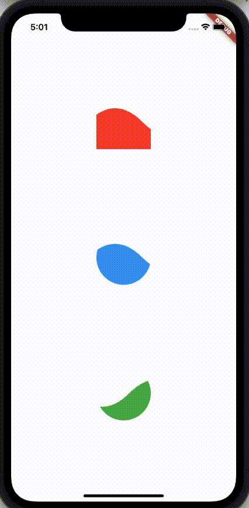

# animated_wave_clipper

A simple clipper with an animated wave.



## Example

```dart
import 'package:animated_wave_clipper/animated_wave_clipper.dart';
import 'package:flutter/material.dart';
import 'package:flutter/widgets.dart';

void main() {
  runApp(
    MaterialApp(
      home: TestWidget(),
    ),
  );
}

class TestWidget extends StatelessWidget {
  @override
  Widget build(BuildContext context) {
    return Scaffold(
      body: Center(
        child: Column(
          mainAxisAlignment: MainAxisAlignment.spaceEvenly,
          children: [
            AnimatedWaveClipper(
              child: Container(
                width: 100,
                height: 100,
                color: Colors.red,
              ),
            ),
            AnimatedWaveClipper(
              child: Container(
                width: 100,
                height: 100,
                decoration: BoxDecoration(
                  shape: BoxShape.circle,
                  color: Colors.blue,
                ),
              ),
            ),
            AnimatedWaveClipper(
              duration: Duration(seconds: 10),
              child: Container(
                width: 100,
                height: 100,
                decoration:
                    BoxDecoration(shape: BoxShape.circle, color: Colors.green),
              ),
            ),
          ],
        ),
      ),
    );
  }
}


```
